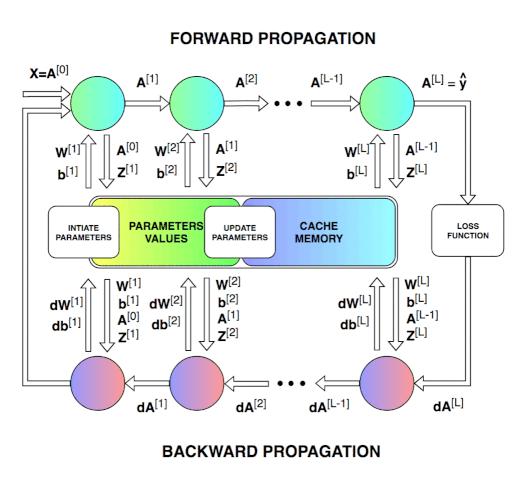

# Yann - Yet Another Neural Network Library

## Purpose

- Reimplement material from [deeplearning.ai](https://www.deeplearning.ai/) in F# to gain deeper understanding.
- Build a .NET Core DNN library for other projects.

## Features

- Written in F#/.NET Core 3 using [Math.NET Numerics on MKL](https://numerics.mathdotnet.com/) 
- Generic Vectorized L-layer FC DNN Library (with unit tests and demo apps)
- Hyperparameters: L, α, Epochs
- Activations: ReLU, Sigmoid
- Cost Functions: Cross entropy
- Initializations: He
- Regularization: L2
- Optimization: -
- Basic transfer learning
- Gradient checking

> Without any performance tuning, it is currently ~33% slower than the numpy implementation for Cats vs non-Cats Week 4 example on ThinkPad X1 Extreme]

## Primary DNN Workflow

> Image (c) [@SkalskiP](https://github.com/SkalskiP/ILearnDeepLearning.py/tree/master/01_mysteries_of_neural_networks/03_numpy_neural_net)

## References

- [deeplearning.ai: Deep Learning specialization](https://www.deeplearning.ai/) course.
- [ILearnDeepLearning.py](https://github.com/SkalskiP/ILearnDeepLearning.py/tree/master/01_mysteries_of_neural_networks/03_numpy_neural_net)
- [UFLDL Tutorial](http://ufldl.stanford.edu/tutorial/).

## TODO

- Initialization: 
  - Add a scale hyper parameters for He initialization
  - Implement other ones (e.g. Xavier for Tanh activation)
